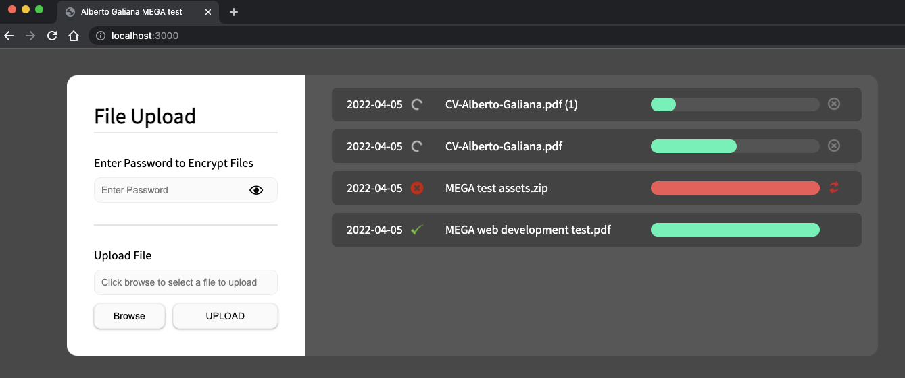

# MEGA web development test
Alberto Galiana <galiana.alberto@gmail.com>

## Test specs

[MEGA web development test](./docs/MEGA-web-development-test.pdf)

## System requirements

- [NodeJS](https://nodejs.org/)
- [Bower](https://bower.io/)

## Install instructions

Install **[bower](https://bower.io/)** web package manager
`npm install -g bower`

Clone **repository**
```
git clone git@github.com:alber999/mega-wd-test.git
cd mega-wd-test
```

Install **server** dependencies
`npm install`

Install **web app** dependencies
`bower install`

You did it! :)

## APP URL

Open [http://localhost:3000](http://localhost:3000) in your browser


## Available commands

| command | description |
| :----- | :------- |
| `npm install` | Install server dependencies |
| `bower install` | Install web app dependencies |
| `npm run serve` | Run web app + server |
| `npm run serve:debug` | Run web app + server in debug mode |
| `npm run lint` | Run lint checks |
| `npm run lint:fix` | Run lint checks and fix |

## Configuration

The server can be configured via [.env](./.env) file

**Default configuration**

```
# server port
PORT=3000

#server max file size to upload, multiplied x2 because encrypted files are larger than original ones
UPLOAD_MAX_SIZE_MB=40
```

## Architecture

Express NodeJS application serving
- **web-app**: static files
- **API**: HTTP service to manage user files

## Source code

Most interesting source code files

### Web app
`src/public`

**UI managers**
[./src/public/js/app.js](./src/public/js/app.js)

**Upload controller**
[./src/public/js/controller/upload.controller.js](./src/public/js/controller/upload.controller.js)

**Auth headers**
[./src/public/js/auth/auth-headers.builder.js](./src/public/js/auth/auth-headers.builder.js)

**Encryption**
[./src/public/js/util/crypto.util.js](./src/public/js/util/crypto.util.js)

**Web workers**
[./src/public/js/worker/auth-headers.worker.js](./src/public/js/worker/auth-headers.worker.js)
[./src/public/js/worker/file-encrypt.worker.js](./src/public/js/worker/file-encrypt.worker.js)

### Server
`src/server`

**Main file**
[./src/index.js](./src/index.js)

**Auth middleware**
[./src/server/auth/routing/auth.middleware.js](./src/server/auth/routing/auth.middleware.js)

**Auth headers signature builder**
[./src/server/auth/signature/signature.builder.js](./src/server/auth/signature/signature.builder.js)

## Testing

Unfortunately no tests implemented

## Features

### File management
- Upload, cancel and retry files
- Handle file name conflicts and offer user different choices
- Encrypted files stored in server folder `./uploads/[userId]`

### End to end encryption
- File encryption takes place in user browser
- Content sent to server is already encrypted

### Security
- **Content Security Policy** (CSP) Headers to detect and mitigate certain types of attacks, including Cross-Site Scripting (XSS) and data injection attacks
- **One Time Password** (OTP) as single use shared secret between web app an server (*fixed string for test purposes, but a real server endpoint is involved in the system flow*)
- **Hash Based Message Authentication** (HMAC) authentication headers in API endpoints

### Non-blocking UI
- Running encryption heavy tasks in background threads (web workers) in user browser

## Server API endpoints

### Alive

**GET /api/alive**
Health endpoint


### One Time Password

**POST /api/user/:userId/otp**
*No authentication headers*

Returns a fixed OTP string for demo purposes to be used as a secret for security headers

### File upload

**POST /api/user/:userId/file**
*Authentication headers mandatory*

Creates an empty file to reserve name in case of:
- **file name conflict**: a file with the same name already exists for the current user
- **concurrency**: same user is trying to upload files with the same name from different devices, browsers or tabs

**PUT /api/user/:userId/file**
*Authentication headers mandatory*

Store a user file in the file system

**DELETE /api/user/:userId/file**
*Authentication headers mandatory*

Deletes a user file. When a file name conflict exists and the user chooses to use the original file name. The empty file with the alternative name must be deleted


## Tech stack

### Web APP

**Dependencies configuration**
[bower.json](./bower.json)

- jQuery
- HTML5 FileReader API
- Web workers
- Javascript

**Crypto libs**

- tweetnacl
- asmcrypto
- crypto-js

***Note**: asmcrypto loaded from cloudflare CDN because of bower version issues*

### Server

**Dependencies configuration**
[package.json](./package.json)

- NodeJS
- Express
- Javascript

**Crypto libs**

- tweetnacl
- crypto-js

## Debug

**VSCode launch configuration**
[launch.json](./.vscode/launch.json)

### Web APP

Start server (debug mode not needed)
`npm run serve` or `npm run serve:debug`

Run VSCode **UI launch** in *debug panel*

### Server

Start server in debug mode
`npm run serve:debug`

Run VSCode **SERVER attach** in *debug panel*

## Google Chrome Lighthouse audit report


## Screenshots

### File upload in progress

There are 3 different file upload states

- uploading
- done
- failed



#### Uploading

File upload can be cancel by clicking on right grey cross action icon

#### Done

File was uploaded successfully

#### Failed

File upload can be restarted by clicking on right red reload action icon

### Duplicate items

A modal window will be shown to user to choose an option


